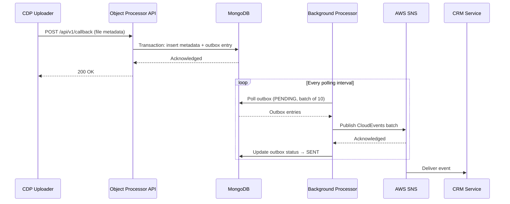

# fcp-sfd-object-processor


[](https://sonarcloud.io/summary/new_code?id=DEFRA_fcp-sfd-object-processor)
[](https://sonarcloud.io/summary/new_code?id=DEFRA_fcp-sfd-object-processor)
[](https://sonarcloud.io/summary/new_code?id=DEFRA_fcp-sfd-object-processor)

## Overview

This service is part of the [Single Front Door (SFD) project](https://github.com/DEFRA/fcp-sfd-core).

The object processor is a REST API and messaging gateway that processes file upload metadata for the SFD service. It receives callbacks from [CDP Uploader](https://github.com/DEFRA/cdp-uploader) after files are scanned and uploaded to S3, persists the metadata to MongoDB, and reliably publishes events to AWS SNS using the [Transactional Outbox pattern](https://microservices.io/patterns/data/transactional-outbox.html). Downstream consumers (CRM, audit service) subscribe to these events to create cases and track submissions.

## Architecture

### Data Flow



### Layered Architecture

```
src/api/          → Routes, handlers, Joi validation schemas
src/services/     → Business logic, transaction management, orchestrates repos
src/repos/        → Database operations (accept session for transactions)
src/data/         → MongoDB client
src/messaging/    → SNS publishing (outbound) and client (sns)
```

**Rules:**
- API handlers call services, never repos directly
- Services coordinate transactions and call multiple repos
- Repos accept a `session` parameter for transaction support

### Why Transactional Outbox?

Writing metadata and publishing to SNS in the same operation risks data loss if SNS is unavailable. The outbox pattern ensures that if data is persisted, the corresponding message will eventually be published. The background processor retries until successful.

MongoDB replica sets are required because the metadata insert and outbox entry creation must happen in a single atomic transaction.


## Prerequisites

- Docker
- Docker Compose
- Node.js (v22 LTS)

No `.env` file is required for basic local development. All defaults are set in `compose.yaml`. See [`.env.example`](.env.example) for optional overrides (SonarQube token, auth configuration).

### SonarQube Cloud token

One of the npm scripts configured for this service enables code scanning by SonarQube Cloud. This will look for any issues and can be ran optionally before committing if the developer wishes to resolve issues during local development. This script helps ensure fewer issues are pushed to GitHub leading to earlier resolution of existing vulnerabilities. In order for this script to run successfully during local development you will need to generate your own personal `SONAR_TOKEN` and add it to your `.env`:

- Log into [SonarQube Cloud](https://sonarcloud.io/login).
- Navigate to your `My Account` settings.
- On the left-hand sidebar navigate to the `Security` tab.
- Under `Generate Tokens` enter a name for your token and click `Generate Token`.
- Copy the token and add it to your `.env`, referring to it as [`SONAR_TOKEN`](.env.example).

## Getting Started

1. Clone the repository:
   ```
   git clone https://github.com/DEFRA/fcp-sfd-object-processor.git
   cd fcp-sfd-object-processor
   ```

2. Start the service and all dependencies:
   ```
   docker compose up --build
   ```

3. Verify the service is healthy:
   ```
   curl http://localhost:3004/health
   ```

4. Try a sample callback request (see [Using the service](#using-the-service) below).

5. View the API documentation at [http://localhost:3004/documentation](http://localhost:3004/documentation).

> **Tip:** For full-stack local development with all SFD services, use the [fcp-sfd-core](https://github.com/DEFRA/fcp-sfd-core) repository instead.

## Running the application

We recommend using the [fcp-sfd-core](https://github.com/DEFRA/fcp-sfd-core) repository for local development. You can however run this service independently by following the instructions below using either Docker Compose or the provided [npm scripts](./package.json). Alternatively, for VS Code users, a set of [VS Code tasks](.vscode/tasks.json) are available to use and can be access via the command palette: 

- `Ctrl` + `shift` + `P` on Windows or `Cmd` + `shift` + `P` on Mac.
- Select `Tasks: Run Task`.
- Choose from the available tasks listed.

### Build container image

Container images are built using Docker Compose.

```
docker compose build
```

Alternatively, an npm script is available:

```
npm run docker:build
```

### Start

Use Docker Compose to start running the service locally.

```
docker compose up
```

Alternatively, an npm script is available:

```
npm run docker:dev
```

### Debugging

Start the service with the Node.js inspector exposed on port 9229:

```
npm run docker:debug
```

Attach your IDE debugger to `localhost:9229`. For VS Code, a debug task is preconfigured in `.vscode/tasks.json`.

For break-on-start debugging (pauses execution until a debugger attaches):

```
npm run start:debug
```

### Documentation

The service uses `hapi-swagger` to auto generate OpenAPI spec available on the [`/documentation`](http://localhost:3004/documentation) endpoint when running the service locally.

A static OpenAPI specification can be found in the `docs/openapi` folder.

To update the static OpenAPI specification file in the `docs` folder please use the npm script `generateOpenApiSpec` when the server is running locally:

```
npm run generateOpenApiSpec
```

This can be used to generate up-to-date information in a OpenAPI specification file which can be pushed to Github and shared with stakeholders.

## Authentication

This service uses **Microsoft Entra ID (Azure AD) JWT authentication** in deployed environments.

- Authentication is **disabled by default** in local development (`AUTH_ENTRA_ENABLED=false` and `AUTH_COGNITO_ENABLED=false` in `compose.yaml`)
- In deployed environments, all routes require a valid JWT unless explicitly opted out with `auth: false`
- Currently unauthenticated routes: `/health` and `/api/v1/callback` (CDP Uploader cannot provide auth tokens)

To enable authentication locally, set `AUTH_ENTRA_ENABLED=true` or `AUTH_COGNITO_ENABLED=true` and configure relevant Auth values in your `.env` file (see [`.env.example`](.env.example) for the format).

Configuration details are in [`src/config/auth.js`](src/config/auth.js) and the auth plugin is at [`src/plugins/auth.js`](src/plugins/auth.js).

## Using the service

Once the service is running locally, the REST API can be used to interact with the CDP uploader and also retrieve information regarding blobs, metadata and specific SBIs. Below is a series of cURL commands that will enable these interactions. 

For any developers who prefer to use a GUI such as Postman, there is a [Postman collection available to use](https://github.com/DEFRA/fcp-sfd-core/blob/main/resources/postman/fcp-sfd-object-processor.postman_collection.json).

As mentioned, all API interactions available (including the possible responses) are described in detail via the `/documentation` endpoint.

### Uploading a file

View the openapi spec for example commands and full API documentation.

The steps to upload a file are as follows:
1. POST to `uploader/initiate`
2. POST direct to cdp-uploader `upload-and-scan/{uploadId}`
Upload is now complete check the status of the upload via: 
3. GET `/uploader/status/{uploadId}`

### Retrieve metadata

Metadata relating to a given SBI (Single Business Identifier) can be retrieved by providing the SBI in question. In this case, from the previous examples this would be `123456789`.

GET ` metadata/sbi/{sbi}"`

### Accessing uploaded files
Using the `/blob/{fileId}` endpoint will generate a short lived presigned url that will enable the file to be viewed/downloaded.

Note: The `fileId` is returned from the `uploader/status/{uploadId}` endpoint or the `/metadata/sbi/{sbi}` endpoint.

The intended flow is as follows


## Local Infrastructure

The following services are started by `docker compose up`:

| Service | Purpose |
|---------|---------|
| `fcp-sfd-object-processor` | This service (port 3004) |
| `mongodb` | Primary datastore with replica set (`rs0`) — required for transactions |
| `floci` | Mocks AWS S3, SQS and SNS locally at `http://floci:4566` (host: `http://localhost:4566`) |
| `redis` | Used by CDP Uploader for session/state management |
| `cdp-uploader` | Upstream file scanning and upload service |

MongoDB connection string: `mongodb://mongodb:27017/?replicaSet=rs0`

## Logging

This service uses [Pino](https://getpino.io/) with [Elastic Common Schema (ECS)](https://www.elastic.co/guide/en/ecs/current/index.html) formatting. **All structured log fields must be nested under `event.*` or `error.*`** — flat top-level fields are not visible on the platform.

### Approved `event.*` fields

| Field | Type | Purpose |
|---|---|---|
| `event.type` | text | Specific event name (e.g. `status_check`) |
| `event.action` | text | Action taken — use for HTTP method or operation |
| `event.category` | text | Broad category — use for request path |
| `event.reference` | text | Reference ID tied to the event — use for `uploadId` or similar |
| `event.reason` | text | Reason/explanation — use for `clientId`, `uploadStatus`, or error cause |
| `event.outcome` | text | Outcome: `success`, `failure`, or `unknown` |
| `event.kind` | text | High-level type — use for HTTP status code |
| `event.duration` | long | Round-trip time in **nanoseconds** (`ms × 1,000,000`) |
| `event.severity` | long | Custom severity level (0–10) |

## HTTP Retry

Outbound HTTP calls (to CDP Uploader) use [`@fetchkit/ffetch`](https://github.com/fetch-kit/ffetch) with configurable retry and exponential backoff.

### Error classification

| Category | Triggers | Behaviour |
|---|---|---|
| `retryable` | 5xx responses, 429 Too Many Requests, network errors (`ECONNREFUSED`, `ETIMEDOUT`, etc.), timeout | Retried up to `HTTP_RETRY_MAX_ATTEMPTS` |
| `nonRetryable` | 4xx responses (excluding 429), user abort | Not retried — fails immediately |
| `unknown` | Unrecognised/unexpected errors | Retried up to `RETRY_UNKNOWN_MAX_ATTEMPTS` (conservative budget) |

### Retry metadata

The HTTP client preserves existing success response contracts. For terminal thrown errors (for example, timeout/network failures), the error is enriched with:

- `error.retryMetadata.attempts`
- `error.retryMetadata.category` (`retryable`, `non-retryable`, `unknown`)
- `error.retryMetadata.terminalReason`

Retry decisions, terminal failures, and retry recovery are logged from the HTTP client layer using ECS-style `event.*` fields.

### Configuration

| Variable | Default | Description |
|---|---|---|
| `HTTP_RETRY_MAX_ATTEMPTS` | `3` | Total attempts (including first) for retryable errors |
| `HTTP_RETRY_BASE_DELAY_MS` | `500` | Initial backoff delay in milliseconds |
| `HTTP_RETRY_BACKOFF_MULTIPLIER` | `1.5` | Multiplier applied each retry (500 → 750 → 1125 ms) |
| `HTTP_RETRY_JITTER_PERCENTAGE` | `15` | ±% random jitter added to each delay to avoid thundering herd |
| `HTTP_RETRY_MAX_DELAY_MS` | `15000` | Hard cap on any single retry delay |
| `RETRY_UNKNOWN_MAX_ATTEMPTS` | `2` | Total attempts for unknown errors (1 retry) |
| `RETRY_UNKNOWN_MAX_DELAY_MS` | `10000` | Hard cap on unknown-error retry delays |

Request timeout per attempt is controlled by `CDP_UPLOADER_TIMEOUT_MS` (default `30000` ms).

See [`src/config/retry.js`](src/config/retry.js) and [`src/http/client.js`](src/http/client.js) for implementation details.
| `event.created` | date | Time the event was created |

### Approved `error.*` fields

When logging error context, nest fields under `error` alongside the `event` object:

| Field | Type | Purpose |
|---|---|---|
| `error.code` | keyword | HTTP status or system error code (e.g. `422`, `ECONNREFUSED`) |
| `error.message` | text | Human-readable error message |
| `error.stack_trace` | keyword | Full stack trace |
| `error.type` | keyword | Error class name (e.g. `ValidationError`, `TypeError`, `Error`) |

### Log builder utilities

Reusable structured log builders live in [`src/utils/`](src/utils/) and must use only approved ECS fields nested under `event` or `error`. Examples of the pattern:

- [`build-uploader-status-log.js`](src/utils/build-uploader-status-log.js) — `event.*` fields for outbound CDP Uploader requests
- [`build-callback-validation-failure-log.js`](src/utils/build-callback-validation-failure-log.js) — combined `event.*` + `error.*` for callback validation failures
- [`build-auth-failure-log.js`](src/utils/build-auth-failure-log.js) — authentication failure context

> **Rule:** Any new log builder must follow this pattern. Do not use flat top-level fields — they are not visible on the platform.

## Tests

This project uses **[Vitest](https://vitest.dev/)** (not Jest). Use `vi.fn()` and `vi.mock()` for mocking.

### Test structure

The tests have been structured into sub-folders of `./test` as per the
[Microservice test approach and repository structure](https://eaflood.atlassian.net/wiki/spaces/FPS/pages/1845396477/Microservice+test+approach+and+repository+structure). 

| Directory | Purpose |
|-----------|---------|
| `test/unit/` | Unit tests with mocked dependencies |
| `test/integration/narrow/` | Integration tests with real MongoDB |
| `test/mocks/` | Shared mock data (reuse these!) |

Test mocks and sample payloads used by unit and integration tests are documented in the [mocks README](test/mocks/README.md).

### Running tests

A convenience npm script is provided to run automated tests in a containerised
environment. This will rebuild images before running tests via Docker Compose,
using a combination of the `compose.yaml` and `compose.test.yaml` files.

```
npm run docker:test
```

Tests can also be started in watch mode to support Test Driven Development (TDD):

```
npm run docker:test:watch
```

As mentioned previously, Docker Compose can be used directly for starting tests:

```
docker compose -f compose.yaml -f compose.test.yaml run --rm "fcp-sfd-object-processor"
```

### Running a single test

To run a specific test file locally (requires local MongoDB with replica set):

```
npx vitest run test/unit/path/to/file.test.js
```

To run in watch mode for a single file:

```
npx vitest watch test/unit/path/to/file.test.js
```

> **Note:** `npm test` and `npx vitest run` require a local MongoDB instance with replica set support. Use `npm run docker:test` for a self-contained containerised test run.

## Pre-commit Hooks

For local development, this repository includes [`pre-commit` hooks](https://pre-commit.com/). These hooks allow for early identification of issues and vulnerabilities so that the developer can resolve any issues before pushing up to the public repository on GitHub. The hooks include:

- [`detect-secrets`](https://github.com/Yelp/detect-secrets): for detecting and preventing secrets in the codebase being pushed to public/open-source repositories.
- `eslint-fix`: a custom hook for running the linter, ESLint + [neostandard](https://www.npmjs.com/package/neostandard?activeTab=readme), to ensure consistent code formatting and styling and additionally uses the `--fix` option to automatically fix any identified issues where possible to reduce the need for manual correction.

To see the full output of the above hooks it is recommended to commit via the command line as using the source control panel does not provide the same feedback and loses sight of the `pre-commit` logs. All `pre-commit` hooks are listed in the [`.pre-commit-config.yaml`](.pre-commit-config.yaml) configuration file.

For these hooks to successfully apply during local development ensure  Python and its package manager, `pip3`, are installed on your machine. Installation of `pre-commit` can then be completed via `pip3`:

```
pip3 install pre-commit
```

## Troubleshooting

| Issue | Solution |
|-------|----------|
| MongoDB fails to start / replica set errors | Run `docker compose down -v` to clear volumes, then `docker compose up` again. The replica set initialisation script in `compose/` needs a clean state. |
| Port 3004 already in use | Another service is using the port. Stop it or change the port in `compose.yaml`. |
| `pre-commit` hook blocks commit with detect-secrets false positive | Add the false positive to `.secrets.baseline` by running `detect-secrets scan --baseline .secrets.baseline`. |
| Tests pass in Docker but fail locally | Local tests require a MongoDB instance with replica set support. Use `npm run docker:test` for a fully containerised run. |
| `docker compose up` hangs | Check Docker Desktop is running and has sufficient resources allocated (recommend at least 4GB RAM). |

## Related Repositories

| Repository | Description |
|-----------|-------------|
| [fcp-sfd-core](https://github.com/DEFRA/fcp-sfd-core) | Full-stack local development orchestration for all SFD services |
| [cdp-uploader](https://github.com/DEFRA/cdp-uploader) | Upstream file scanning and upload service |

## Licence

THIS INFORMATION IS LICENSED UNDER THE CONDITIONS OF THE OPEN GOVERNMENT LICENCE found at:

<http://www.nationalarchives.gov.uk/doc/open-government-licence/version/3>

The following attribution statement MUST be cited in your products and applications when using this information.

> Contains public sector information licensed under the Open Government license v3

### About the licence

The Open Government Licence (OGL) was developed by the Controller of His Majesty's Stationery Office (HMSO) to enable information providers in the public sector to license the use and re-use of their information under a common open licence.

It is designed to encourage use and re-use of information freely and flexibly, with only a few conditions.
